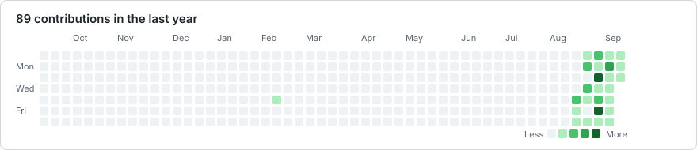

  

  # Ivan Lee Dorillo

  **BSIT student building practical, AI-assisted web applications**

  PHP & Laravel · MySQL · Responsive web development

  [Portfolio](https://github.com/ivanleedorillo-ops/Dorillo-Portfolio) ·
  [LinkedIn](https://www.linkedin.com/in/ivan-lee-dorillo-0585aa426/) ·
  [Email](mailto:ivanleedorillo@gmail.com)

## About me

I'm a third-year BSIT student who learns by shipping real projects. My current work combines PHP, Laravel, and MySQL with AI-assisted development workflows to turn ideas into useful, maintainable web applications.

- Building portfolio-ready full-stack projects
- Deepening my Laravel, database design, and PHP fundamentals
- Interested in internships, collaboration, and hands-on learning

## Featured work

| Project | What it does | Built with |
| --- | --- | --- |
| [HorizonBias](https://github.com/ivanleedorillo-ops/HorizonBias) | Provides transparent, multi-timeframe XAU/USD market analysis with live charting and separate AI-powered macro context—without trade execution. | Laravel, PHP |
| [ResearchVault](https://github.com/ivanleedorillo-ops/ResearchVault) | Helps school librarians manage approved institutional research while students browse, search, and access studies. | Laravel, MySQL, Blade |
| [PHP Learning Journey](https://github.com/ivanleedorillo-ops/PHP-Learning-Journey) | Documents my progress from PHP fundamentals to MySQL and small practical projects. | PHP, MySQL |

## Toolbox

  

## Contribution activity

  
  Generated from GitHub's official contribution data and refreshed automatically.

## Let's connect

I'm open to internship opportunities, project collaboration, and conversations about web development.

[LinkedIn](https://www.linkedin.com/in/ivan-lee-dorillo-0585aa426/) · [Facebook](https://web.facebook.com/ivanlee.dorillo) · [ivanleedorillo@gmail.com](mailto:ivanleedorillo@gmail.com)

---

  Build · Test · Learn · Improve

